# LocDB

<b>A database schema for Taxi Management services.</b>

```
MIS: 111811052
Name: Anup Nair
Class: TY B.Tech
Division: 2
Batch: T4
```

#### Project Description:

<b>LocDB - A Taxi management service</b>
With the increasing demand of online services, the taxi booking services have emerged to be one of the primary sectors where databases are employed heavily. Although there is a lot of optimizations and tools being deployed for the major real-life use cases, a simple and basic version of the same design pattern is aimed at by this project. The major focus of LocDB is to simulate a smaller case scenario of a location based reactive system. The basic requirement of the entire project will rely heavily on the database design and the way the data is represented for the needed services. LocDB will provide a similar interface wherein a customer can book taxis that are in a proximity to their current location and create trips to new locations. The underlying gist of the project is to handle updates and provide services by efficient retrieval of data from the database. The other enhancements can include seeing the trip history and nearby places that have been visited and so on

#### Tech Stack Used:

```
Programming Languages:
1. JavaScript
2. HTML5.1
3. CSS3
4. SQL 8.0.2.1

Frameworks:
1. MySQL
2. React
3. Express
4. NodeJS
```

#### Project Screenshots:

This section contains the screenshots for various stages during the use of the application.

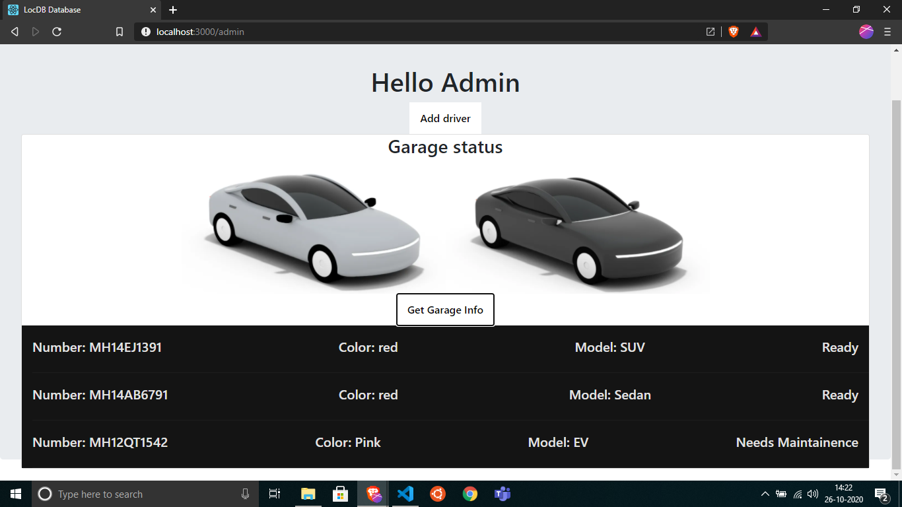
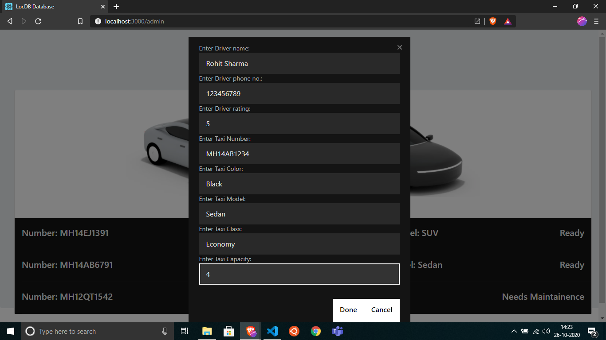


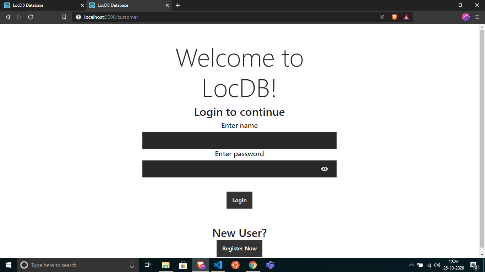
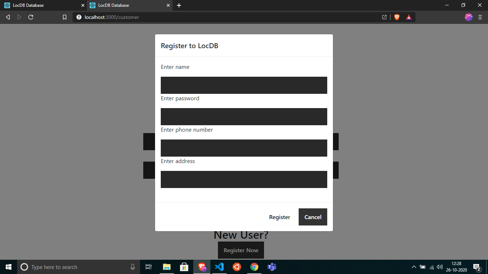
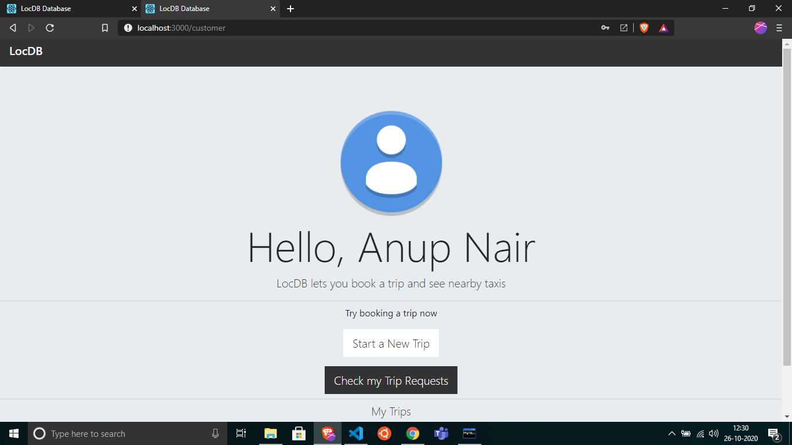
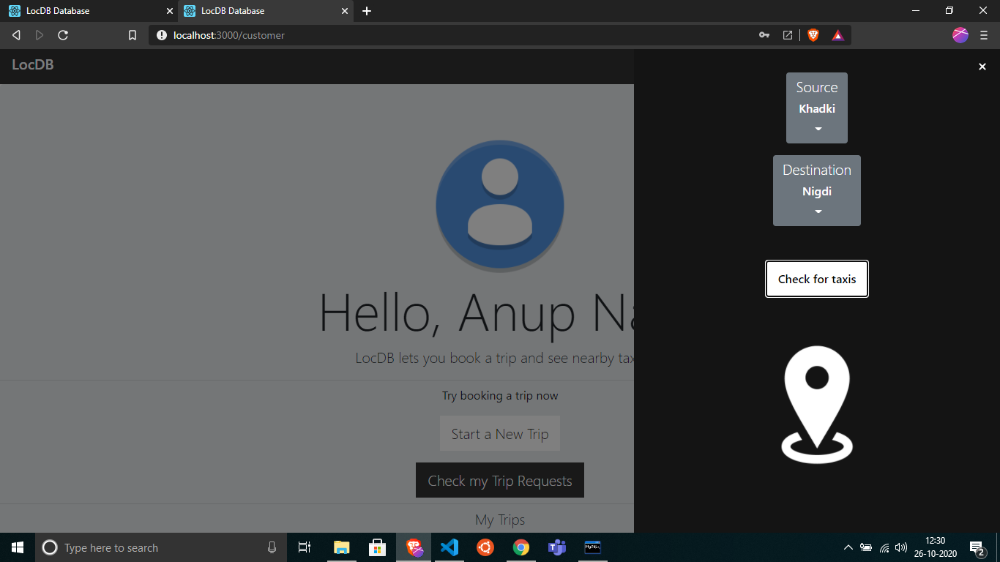
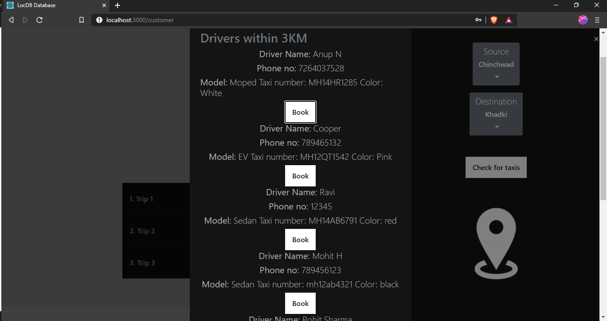
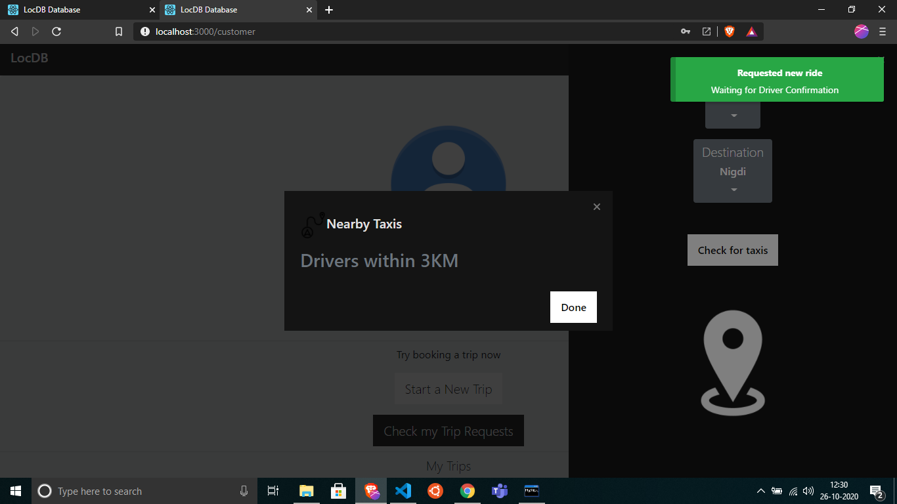
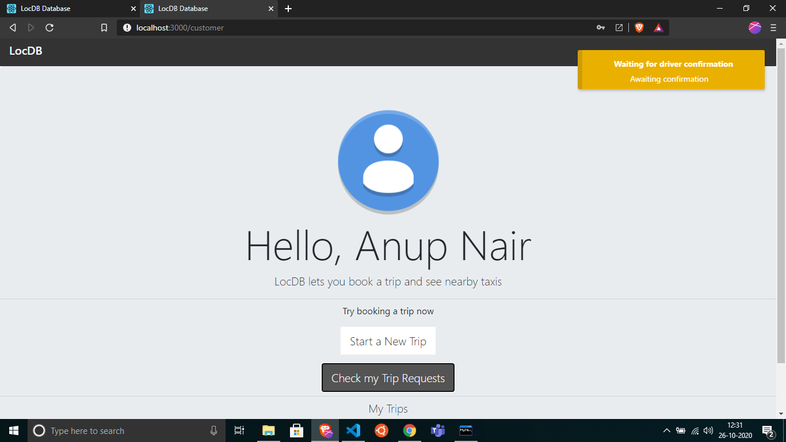
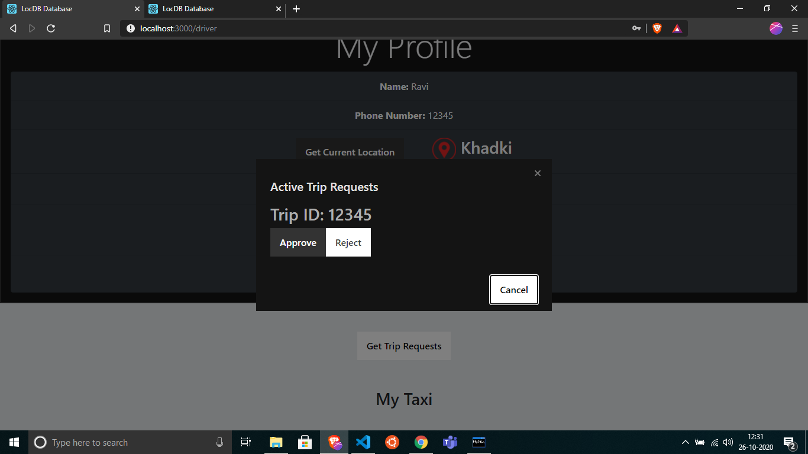
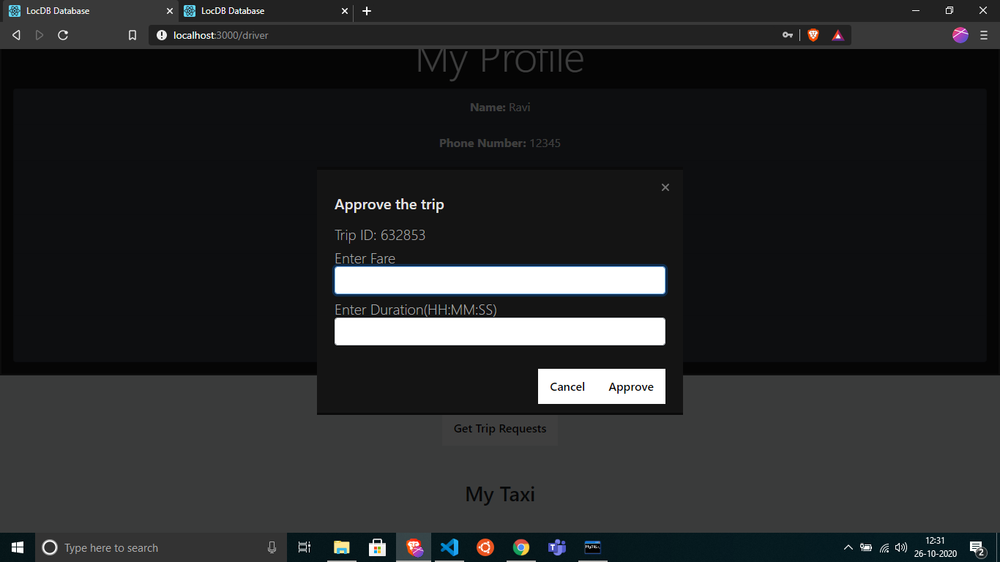
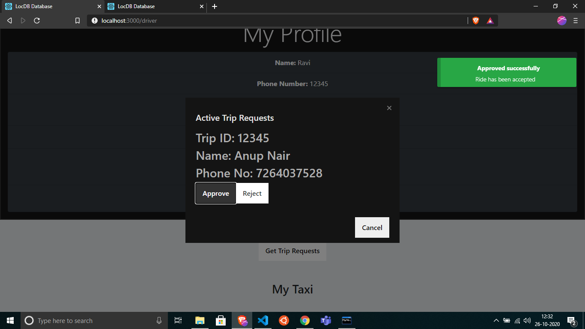

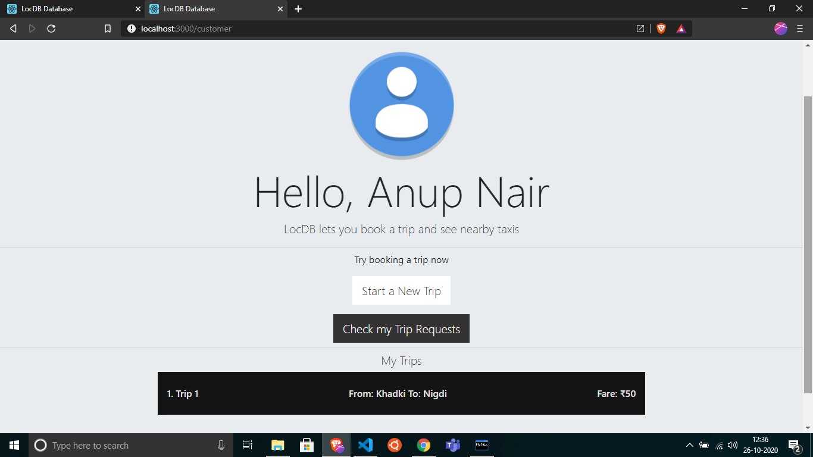
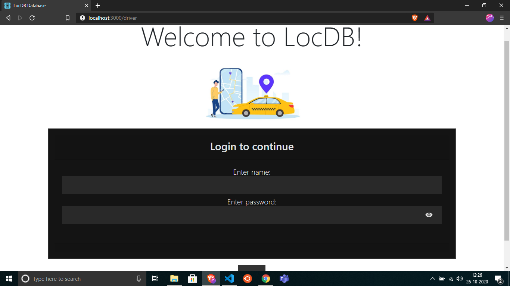
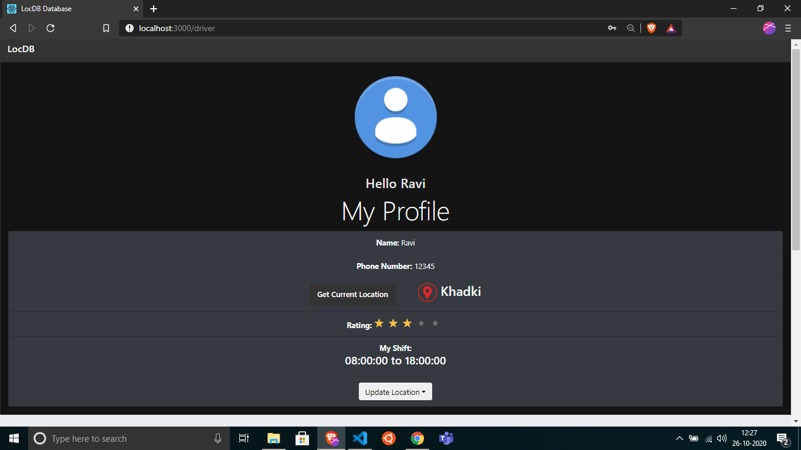
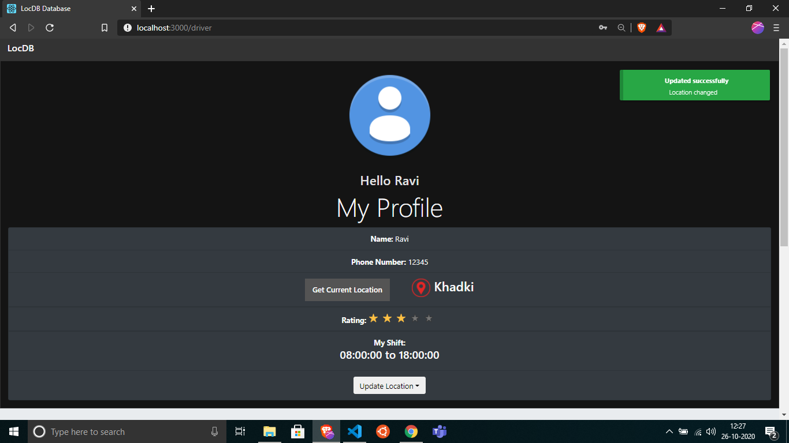
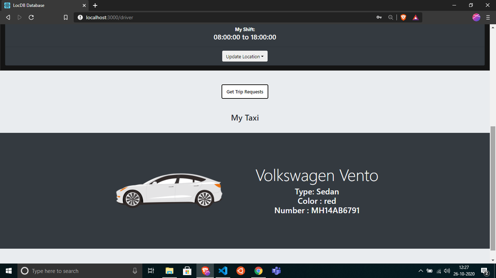
