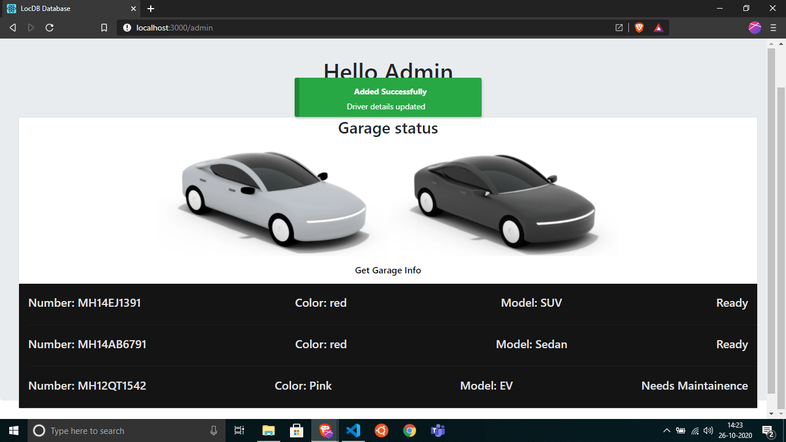
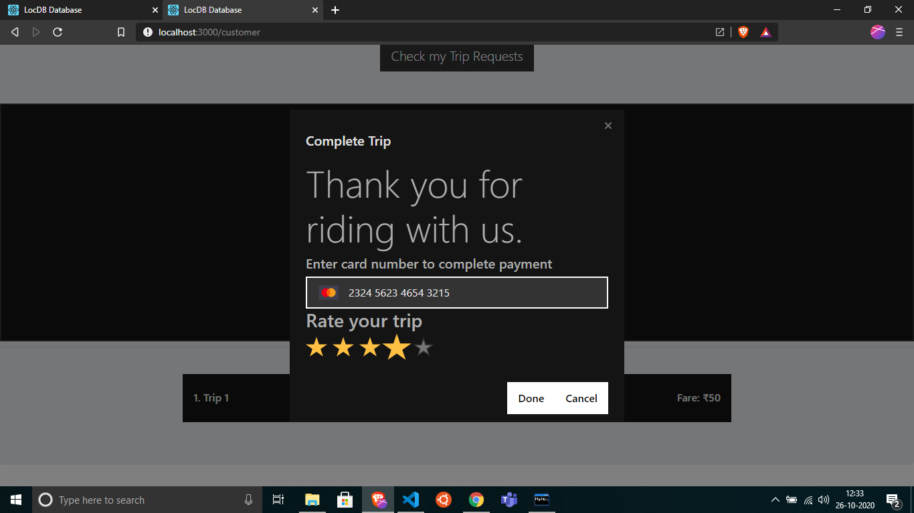

# LocDB

<b>A database schema for Taxi Management services.</b>

```
MIS: 111811052
Name: Anup Nair
Class: TY B.Tech
Division: 2
Batch: T4
```

<hr>

#### Project Description:

<b>LocDB - A Taxi management service</b><br>
With the increasing demand of online services, the taxi booking services have emerged to be one of the primary sectors where databases are employed heavily. Although there is a lot of optimizations and tools being deployed for the major real-life use cases, a simple and basic version of the same design pattern is aimed at by this project. The major focus of LocDB is to simulate a smaller case scenario of a location based reactive system. The basic requirement of the entire project will rely heavily on the database design and the way the data is represented for the needed services. LocDB will provide a similar interface wherein a customer can book taxis that are in a proximity to their current location and create trips to new locations.

<hr>

#### ER Diagram


<hr>

#### Tech Stack Used:

```
Programming Languages:
1. JavaScript
2. HTML5.1
3. CSS3
4. SQL 8.0.2.1

Frameworks:
1. MySQL
2. React
3. Express
4. NodeJS
```

<hr>

##### Installation guide:

```
git clone [repo link]

Install the dependencies
cd locdb & npm i
cd locdb/backend & npm i

Run the frontend
npm start

Run the backend
cd backend
nodemon server.js
```

<hr>

## Project Features:

The project consists of three interfaces:

1. <b>Admin</b>

```
1. Add Drivers
2. View the Garage Status
```

2. <b>Customer</b>

```
1. Can login/register into the system
2. The customer can request for new trips from the home screen
3. The source and destination of the trips can be selected and the nearby taxis will be listed.
4. From the list one taxi can be selected and the driver will be notified about the request.
5. The status of booking can be viewed.
6. Once the driver approves the request then then trip will be started.
7. The trip can be ended by the customer by providing rating and payment details
8. All the trip history of the user can be seen on the home screen.
```

3. <b>Driver</b>

```
1. Can login to the system and view details about location, rating etc.
2. Can update current location from the home screen.
3. The driver can check their shift times and taxi details.
4. All the trip requests to the driver can be seen in requests list.
5. The driver can approve the trip and select fare and duration of the ride.
6. The driver will get rating after completing the trip.
```

<hr></hr>
<h3>Admin</h3>
  <p><b>The admin can create and add new drivers to the database and can also monitor the garage and the status of the vehicles.</b></p>

  
  
  

 <hr></hr>
 <h3>Customer</h3>

  
    <p><b>The customer can either choose to login or register from the home screen. Once logged in they will go the home page </b></p>
  
  

  <p><b>From here the customer can book a ride by choosing source and destination.</b></p>
  
  
  <p><b>Nearby Taxis will be listed and the ride can be booked by choosing any one of the taxis.</b></p>
  
  
  

  <p><b>From here we can go the driver page and check for the active requests that have been received. The requests can be either accepted or rejected. After accepting the request the fare and duration of the ride are to be listed.</b></p><br>
  
  
  
  <p><b>After completing the trip the customer can end the trip and can give ratings and choose payment methods. The trip will get recorded in the trip history.</b></p>
  
   
  <hr></hr>
<h3>Driver Interface</h3>
  <p><b>The login screen for the driver. Will be redirected to the home screen from here. From the home screen the location of the driver can be updated.</b></p>
  
  
  <p><b>Trip requests can be viewed and accepted or rejected from this screen.</b></p>
  
  <p><b>The driver's taxi details also appear on the home screen.</b></p>
  
